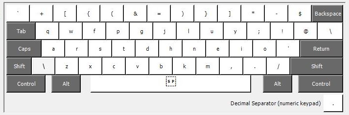
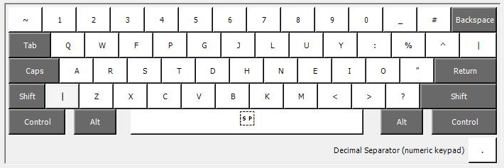

# prime_colemak

This is a keyboard layout based on
[the_primeagen's](https://github.com/ThePrimeagen/keyboards) keyboard layout.
Keys are remapped while using the kinesis 360, so they work the best for other
keyboards.

## base layer

## shift layer

## install

follow this
[tut](https://www.addictivetips.com/windows-tips/install-custom-keyboard-windows-10/)

download the `.klc` file and load it to the layout creator then buid dll.
